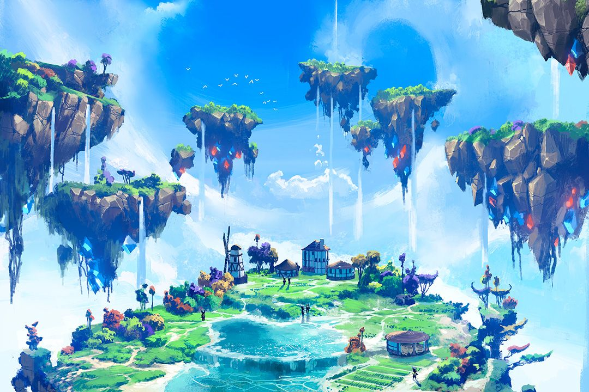
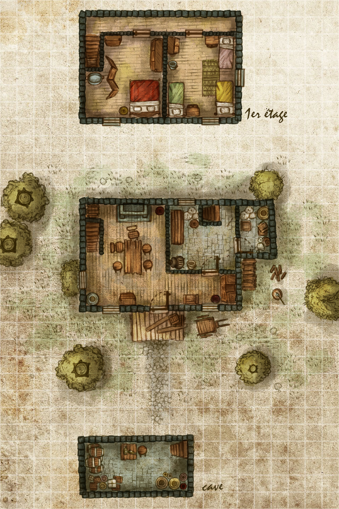
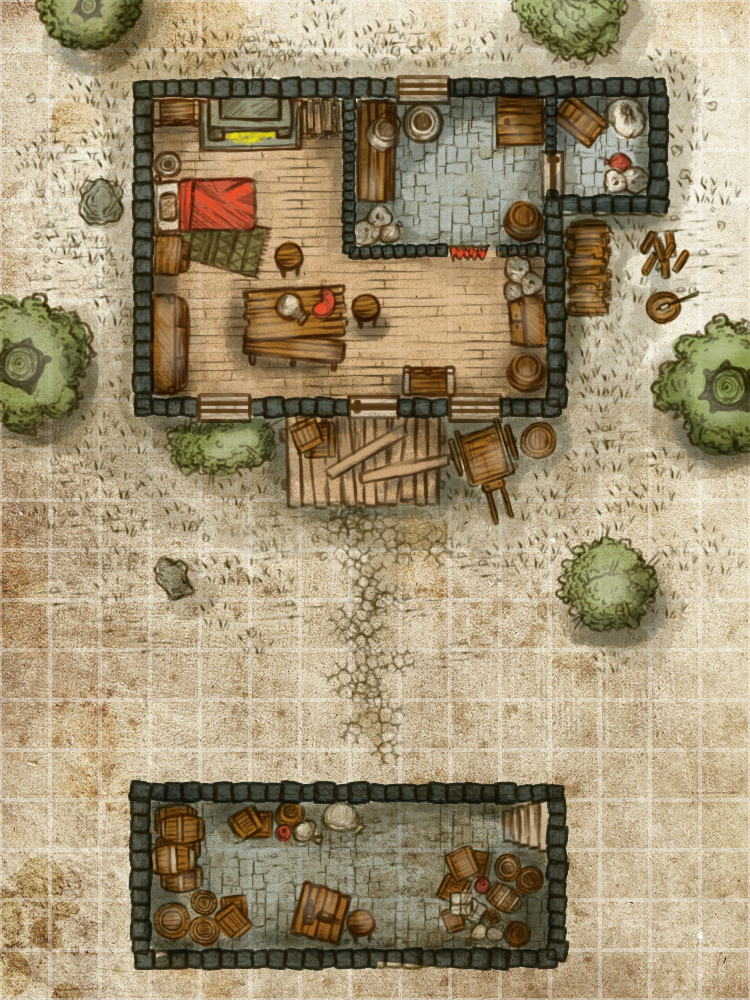

# Introduction
In this module, you will be exploring the vast planet of Orizon, and all that it has to offer.
The most important thing you must know is that Orizon features skyborn, floating islands.
These masses of land stay afloat due to a powerful arcane crystal known as ætherium.
These islands would collapse without them.

## Coming Together
Due to the nature of this story, we suggest the players agree that their characters are a sort of family.
For the best possible experience, the DM and players starting this module must work together to forge the characters' backstory and relationships early on.

We recommend two or more player characters to be the youthful (less than 25 years old) descendants of a loving human grandmother by the name of **Mabel Longriver**.
The original parents of these children passed away in a tragic fall too early in their life.

Of course, some players may not wish to play human characters.
In this case, the parents (*and even Mabel herself*) have a soft spot for orphans, and would have gladly adopted in some of the less fortunate as honorary members of the Longriver family.

Even then, other players may not wish to play youthful characters.
If this happens, Mabel could hire fair and loyal labor in exchange for modest pay, a roof to sleep under, and a seat at the dinner table.
She is beginning to get too elderly to take care of everything herself.
Given time, watching Mabel's grandchildren grow up could have a profound impact on this player character's life.

### The Southwind Farm &amp; Estate
Miss Longriver owns the Southwind Farm &amp; Estate and tends to its needs, alongside the player characters.
The estate itself is located on a secluded skyborn archipelago.
Just one of these flying isles is large and sturdy enough to support a few buildings, a fishery, and a farm.

The estate itself is four acres wide, and has a main house, a guest house, a windmill, and two storage sheds.
One of the predominate features on this isle is a large, self-generating freshwater lake housing a supple fishery.
The source of the water is a crystal at the bottom of the lake that spouts water indefinitely.

An entity called the Great Empire has dominion over this region, and asserts their laws and taxes on the estate.
That said, the farm property is in Mabel Longriver's name, and she manages its business endeavors within the family.
To that end, Mabel knows just how privileged her family is.

The future generation of the Longriver family as it stands has been living peacefully on this land for about two decades now.
However, Miss Longriver knows that it will soon be time to pass on the estate and let the children flourish into the world at large.

#### Growing Up on the Estate
The player characters should mostly look fondly and sentimentally upon their childhood on the estate.
Mabel Longriver would go through great lengths to raise her grandchildren.
She instilled a working ethic through farm labor and business practice.
She would hire educational experts to come and train the children to read, or wield a sword.
Sometimes, she would take the children on vacations to see vast cities and grasslands, telling great stories of their history.
Most of all, Miss Longriver spoiled her grandchildren, and tried her very hardest to make each of them as happy as they could be.

Nevertheless, there is only so much that one can do on a secluded stretch of four acres.
Every inch of that estate has been traveled a thousand times over by its inhabitants.
By now, the player characters must start to have some sort of anxiety living on this mote of land, perhaps claustrophobia, or just plain boredom.

Whatever the case, the Longriver family lives a secluded, naïve, and innocent life with a great degree of privilege.

## Creating Your Character
The above passage is the base of your backstory.
At this point in the game, the details of your backstory is most important.
Consider a fond memory that you might have had with one of the other player characters.

Now, follow this character generation method:
1. Generate your ability scores as normal.
1. Pick your fantasy race and subrace.
1. Write your backstory.
1. Determine your background.
1. You start as a level 0 farmer.
	- *NOTE: Your character will begin without choosing a class.*
	*You will start at level zero.*
	*Do not worry; you will end your first session by choosing your first level.*
1. You begin with Max Hit Points equal to 1d8 (or 5) + your Constitution modifier.
	- *You will keep these Max Hit Points as a bonus when you earn your first level.*
